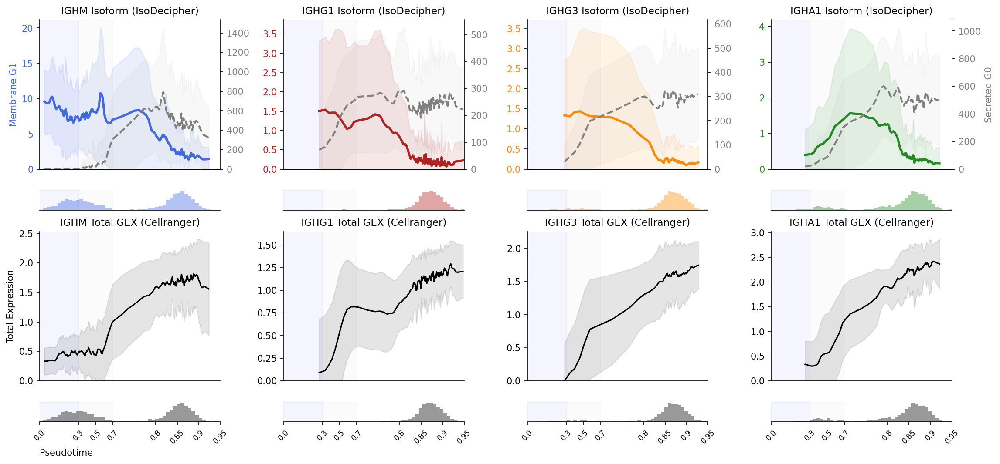
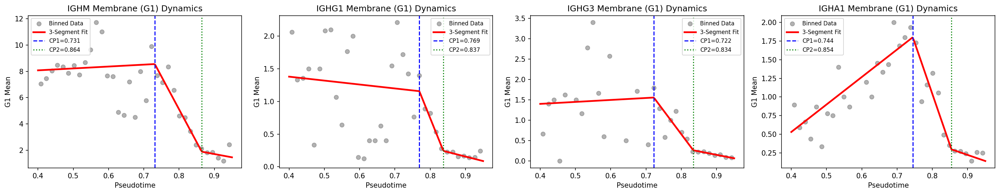
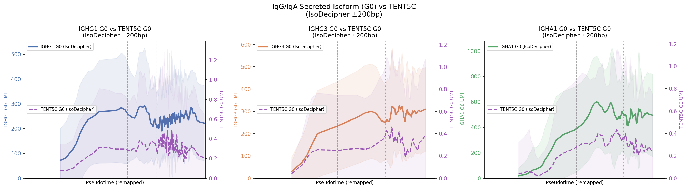
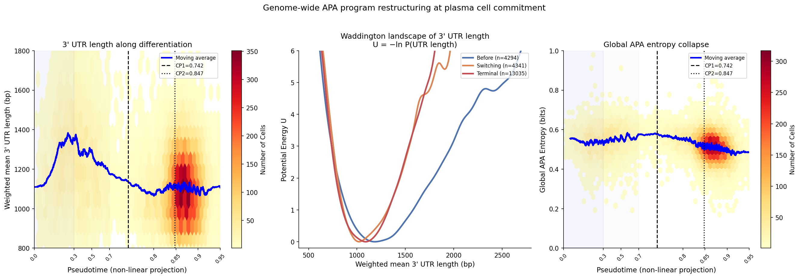
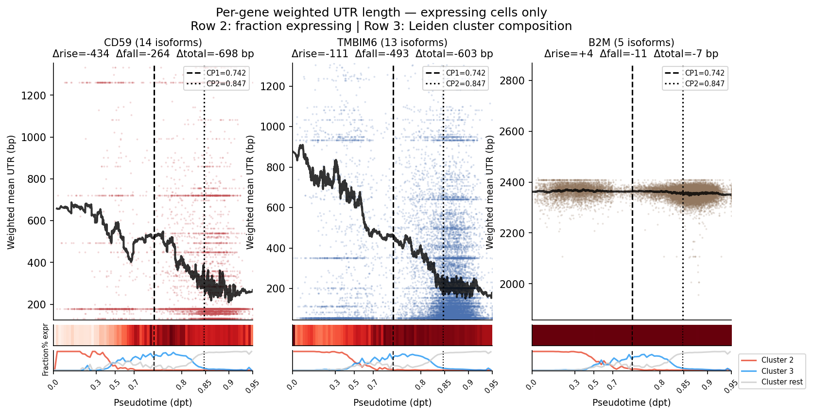
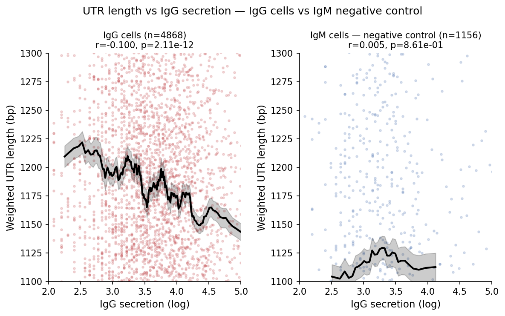

# IsoDecipher

**IsoDecipher** is a targeted isoform quantification tool designed for **3' single-cell RNA-seq (scRNA-seq)** data.

It recovers hidden biological signals—such as **Alternative Polyadenylation (APA)** and **B-cell antibody isoform switching**—by re-interpreting **3' read distributions** that standard pipelines collapse into gene-level counts.

[](LICENSE)
[]()
[]()

---

## Ecosystem

IsoDecipher is part of a suite of tools for single-cell 3' end biology:

| Tool | Scope | Status |
|------|-------|--------|
| **IsoDecipher** | APA quantification from 3' scRNA-seq BAMs — GTF-anchored, scanpy-ready | ✅ Active |
| **[IsoCAPE](https://github.com/iso-apa/isocape)** | Cryptic & premature polyadenylation detection — AR-V7 and beyond | 🔧 In development |
| **[IsoFormer](https://github.com/iso-apa/isoformer)** | Foundation model for polyadenylation grammar at single-cell resolution | 🔧 In development |

*Learning the polyadenylation grammar of life, and where cancer breaks the rules.*

**IsoDecipher** and **IsoCAPE** are designed to complement each other — IsoDecipher covers the known annotated APA landscape, IsoCAPE covers what the GTF misses (intronic termination, cryptic exons, AR-V7). Their outputs share the same AnnData structure and can be concatenated for a complete 3' end landscape:

```python
import anndata as ad
import scanpy as sc

apa     = sc.read_h5ad("isodecipher_output.h5ad")   # annotated APA
cryptic = sc.read_h5ad("isocape_output.h5ad")        # cryptic sites

combined = ad.concat([apa, cryptic], axis=1)
```

---

## Concept

Standard scRNA-seq pipelines collapse transcript isoforms into gene-level counts, losing the isoform information that determines cell function. IsoDecipher recovers this information by reinterpreting the genomic positions of 3' reads to quantify polyadenylation site usage.


The membrane-to-secreted isoform switch of immunoglobulin heavy chain genes — driven by alternative polyadenylation — determines whether a B cell displays BCR on its surface or secretes antibody. This transition is invisible to Cellranger total GEX but is directly quantifiable by IsoDecipher from standard 3' BAM files.

```
scRNA-seq reads → Cell Ranger → gene counts (isoform lost)

Cell        IGHM
--------------------
cell_1        12
cell_2        18
cell_3         9
```

IsoDecipher **reinterprets the genomic positions of 3' reads** to recover polyA site usage:

```
Cell      IGHM_G0_Secreted   IGHM_G1_Membrane
----------------------------------------------
cell_1          100                 2
cell_2           4                 14
cell_3          50                  1
```


### GTF-anchored polyA site grouping

For genes with multiple transcripts sharing nearby cleavage sites, IsoDecipher consolidates reads within a ±10bp tolerance window into biologically meaningful groups — preventing signal fragmentation across low-confidence peaks that de novo methods would discard as noise.


CD59 has 32 annotated transcripts across 14 polyA groups. IsoDecipher consolidates the 7 transcripts sharing the distal cleavage site into a single G8 group (1,262bp UTR), while the single proximal transcript CD59-212 forms G0 (179bp UTR). This grouping recovers the full isoform switching signal across plasma cell differentiation — signal that would be fragmented and lost by coordinate-based de novo peak callers.

---

## Why IsoDecipher?

| Feature | scAPA | Sierra | MAAPER | IsoDecipher |
|---------|-------|--------|--------|-------------|
| Reference | De novo | De novo | GTF | GTF |
| Output | Peak counts | Peak counts | Site probability | Count matrix |
| Feature names | Coordinates | Coordinates | Gene+Site | Gene+Group |
| Noise filter | ❌ | ❌ | Partial | ✅ |
| Biotype filter | ❌ | ❌ | ❌ | ✅ |
| NMD option | ❌ | ❌ | ❌ | ✅ |
| Transcript consolidation | ❌ | ❌ | ❌ | ✅ |
| Scanpy ready | ❌ | ❌ | ❌ | ✅ |
| IG isoform logic | ❌ | ❌ | ❌ | ✅ |
| Metric selection | Fixed | Fixed | Fixed | Adaptive (PUI/Entropy) |

IsoDecipher is the only tool that combines GTF-anchored noise suppression, biotype-aware filtering, and transcript consolidation into a scanpy-compatible count matrix — enabling isoform-resolved single-cell analysis without post-processing.

**Why transcript consolidation matters:** For genes with multiple transcripts sharing nearby cleavage sites (e.g., CD59 G8 consolidates 7 transcripts within ±10bp), de novo tools fragment reads across low-confidence peaks and MAAPER assigns separate probabilities per site — both approaches dilute signal below detection threshold. IsoDecipher pools these reads into a single group, recovering isoform dynamics that would otherwise be lost.

**IG-aware panel design:** Immunoglobulin heavy chain genes (IGHM, IGHG1-4, IGHA1-2) are annotated with functional labels (G0=Secreted, G1=Membrane) in `panel_features.csv`, enabling direct interpretation of the membrane-to-secreted isoform switch without manual curation. This labeling is automatically applied during panel construction and can be extended to any gene by editing `panel_features.csv` directly. The default gene panel is immunology and oncology focused (391 genes across 22 categories) — users targeting other biological contexts can supply a custom `gene_list.txt` to build a domain-specific panel.

**Adaptive metrics:** PUI (2 isoform groups) or Shannon entropy (3+ groups) are selected automatically per gene. PUI uses log-normalization essential for high-dynamic-range genes such as immunoglobulins. By default NMD transcripts are excluded; use `--include-nmd` to add AS-NMD isoforms (+271 features, 14 genes promoted to PUI/Entropy analysis).

**ML-ready:** PUI/Entropy features achieve 64% accuracy (vs 77% full GEX) predicting terminal plasma cell commitment using only 40 APA features — capturing the majority of cell state information in a 42-fold smaller feature space. APA subclustering of the GEX-defined plasma cell blob resolves 5 distinct subpopulations — including a novel interferon-stimulated plasma cell state — that are completely indistinguishable by transcriptome analysis alone. Combined with SEC-seq, IsoDecipher directly links APA-driven UTR shortening to antibody secretion output at single-cell resolution (r=−0.100, p=2.11×10⁻¹², replicated across two independent experiments).

---

## Key Biological Findings

### 1. IgH isoform dynamics along B cell differentiation

IsoDecipher recovers membrane (G1) and secreted (G0) isoforms of immunoglobulin heavy chain transcripts across B cell differentiation for four isotypes (IGHM, IGHG1, IGHG3, IGHA1). The membrane-to-secreted switch arises from APA: G1 utilizes a distal polyadenylation site retaining transmembrane domain exons; G0 uses a proximal site enabling antibody secretion. Cell Ranger total counts increase monotonically across pseudotime for all isotypes, providing no resolution of this transition — IsoDecipher recovers the directionality directly from 3′ BAM files. The G1 decline is a genuine per-cell signal, not a cell-density artifact (minimum n=50 isotype-matched cells per window).

### 2. Quantitative mapping of IgH membrane isoform dynamics


Piecewise linear modeling identifies conserved changepoints: G1 decline initiates at CP1 (~0.72–0.77) and completes at CP2 (~0.83–0.86), defining a narrow ~0.09–0.13 pseudotime window consistent across all isotypes. Bimodality coefficients exceed the bifurcation threshold at CP1 (BC > 0.555: IGHM 0.624, IGHG1 0.564, IGHG3 0.670, IGHA1 0.565), confirming a bistable commitment event rather than a continuous gradient.

### 3. TENT5C is co-induced with the IgH secreted isoform at plasma cell commitment


DEG analysis on IsoDecipher-defined Before/Switching/Terminal stages identifies **TENT5C (top DEG hit)** — a cytoplasmic poly(A) polymerase that stabilizes immunoglobulin heavy chain mRNAs by extending their poly(A) tails — as co-upregulated with the APA switch. By leveraging BCR downregulation as a **high-resolution molecular ruler for cell state**, IsoDecipher captures a critical commitment transition that total gene count pipelines overlook — and critically, enables downstream trajectory analysis that pinpoints which isoform event TENT5C tracks. Cross-correlation of smoothed pseudotime trajectories confirms TENT5C induction is temporally aligned with G0 upregulation at lag=0 across all class-switched isotypes (IGHG1, IGHG3, IGHA1) — identifying it as the most directly co-regulated gene with the secreted isoform switch rather than a general plasma cell marker.

TENT5C (FAM46C) is recurrently mutated in multiple myeloma (~20% of cases); its coupling to the secreted isoform switch provides a mechanistic rationale for why its loss dysregulates antibody secretion in malignant plasma cells, and why TENT5C-deleted myeloma cells down-regulate Ig production to redirect energy toward proliferation. In autoimmune disease, TENT5C's co-induction at the commitment checkpoint identifies it as a candidate target for disrupting autoreactive plasma cell commitment, complementing BCMA/TNFRSF17-directed approaches.

### 4. Genome-wide APA program restructuring at plasma cell commitment



Expression-weighted mean 3' UTR length shortens from 1,273 bp to 1,099 bp at CP1 (p < 10⁻³⁰⁰). This is not uniform shortening — the 5th percentile changes minimally (917→857 bp, Δ=60 bp) while the 95th percentile collapses (1,747→1,383 bp, Δ=364 bp), indicating selective elimination of long-UTR states. A transient lengthening peak prior to CP1 reflects activated B cells upregulating distal polyA sites during proliferation and class switch recombination. Waddington landscape and APA entropy analyses independently corroborate progressive isoform repertoire restriction at terminal commitment.

### 5. CD59 and TMBIM6 undergo progressive APA switching during blast-to-plasma cell maturation



CD59 (14 isoforms, Δtotal=−699 bp) and TMBIM6 (13 isoforms, Δtotal=−600 bp) show genuine APA switching confirmed by expressing-cell trajectories and leiden cluster composition. Both are absent in activated B cells (pct=0.083 and 0.031) and switch on in blast/plasmablast clusters — their UTR shortening tracks the plasmablast-to-plasma cell axis, not the activated B cell program. B2M (Δtotal=−7 bp) serves as negative control.

### 6. Isoform-level resolution reveals CD59 and TMBIM6 switching dynamics invisible to total GEX


Cellranger GEX shows nearly identical CD59 detection between Switching and Terminal stages (pct=0.612 vs 0.584) — providing no resolution of underlying isoform dynamics. IsoDecipher reveals that CD59 is selectively induced through its most proximal isoform G0 (179bp, CD59-212) from the onset of plasmablast commitment, while the long-UTR isoform G8 (1,262bp) is transiently co-induced during switching but retreats at terminal differentiation.
For TMBIM6, IsoDecipher resolves a switch from three distinct long-UTR distal isoform groups (G8/G10/G11, 1,813–2,013bp) dominant in the Before stage to a single short-UTR proximal isoform (G4, 55bp) at Switching and Terminal — a transition invisible to Cellranger GEX which shows only a broad increase across stages.
Total IsoDecipher detection rates are consistent with Cellranger GEX across all stages (pct difference < 2%), confirming quantification concordance at the gene level while demonstrating isoform-level resolution unavailable to total count analysis.

### 7. Shorter 3' UTR isoforms are associated with higher IgG antibody secretion at single-cell resolution



SEC-seq captures secreted IgG on barcoded nanovials at single-cell resolution. Across IgG-isotype plasma cells, the highest secretors cluster around 1,000 bp weighted UTR length while the lowest secretors extend to ~1,500 bp — a clear directional trend linking APA-driven UTR shortening (4) to antibody output. IgM-isotype cells show no trend (r=0.005, p=0.86), confirming isotype-specificity and ruling out technical artifact. The result replicates across two independent experiments.

This is consistent with UTR length-dependent regulation of mRNA stability and translational efficiency: shorter 3' UTRs reduce miRNA binding site density and destabilizing AU-rich elements, increasing mRNA half-life and ribosome occupancy. The genome-wide UTR shortening at commitment is therefore not merely a transcriptional signature — it has a measurable functional consequence on the quantity of antibody each cell secretes. These results provide single-cell functional validation of secretion-coupled APA (SCAP), a mechanism described by Cheng et al. (2020, *Nature Communications*) in bulk trophoblast and B cell differentiation, here resolved at single-cell resolution with matched protein secretion readout via SEC-seq.

### Discussion

IsoDecipher's isoform-resolved quantification reveals a coordinated 3' end regulatory program at plasma cell commitment invisible to total GEX analysis. The membrane-to-secreted IgH switch occurs at a conserved checkpoint (CP1 ~0.73) across all isotypes, with IgG showing near-complete G1 silencing while IgM retains residual membrane-form expression — consistent with long-lived IgM plasma cells maintaining low-level surface BCR. Genome-wide, commitment selectively eliminates long-UTR isoform states rather than uniformly shortening UTRs, as confirmed by asymmetric percentile collapse (95th percentile: 1,747→1,383 bp; 5th percentile: 917→857 bp) and monotonic APA entropy decline.

The UTR shortening program is consistent with secretion-coupled APA (SCAP), described by Cheng et al. (2020, *Nature Communications*) as a mechanism that boosts protein production capacity by generating shorter 3'UTR isoforms with higher mRNA stability. IsoDecipher extends this finding to single-cell resolution, and SEC-seq ([github.com/Rene2718/SEC-seq_plasma-cell_nanovial](https://github.com/Rene2718/SEC-seq_plasma-cell_nanovial)) provides direct functional validation: cells with shorter weighted UTRs secrete measurably more IgG, confirming that SCAP has per-cell consequences detectable without bulk averaging.

The therapeutic implications are concrete. TENT5C (FAM46C), co-induced with the secreted isoform at lag=0, is recurrently mutated in myeloma (~20% of cases) — its coupling to the APA switch provides a mechanistic rationale for why its loss dysregulates antibody secretion in malignant plasma cells. CD59 is both transcriptionally upregulated and undergoes progressive APA-driven shortening to its shortest UTR isoform (G0, 179bp) at peak secretion — a dual-layer complement evasion mechanism. In multiple myeloma, this coordinated program likely contributes to resistance against complement-dependent cytotoxicity elicited by antibody therapies such as daratumumab and elotuzumab. Critically, the APA component of this evasion operates independently of protein level changes and would be missed entirely by standard GEX analysis. The CP1 window (~0.09–0.13 pseudotime units) further defines a narrow intervention point to selectively eliminate autoreactive plasmablasts in autoimmune diseases such as SLE before irreversible long-lived plasma cell differentiation is established.

Finally, our findings establish a critical baseline of isoform-level transcriptomic order in healthy plasma cell differentiation: normal terminal plasma cells achieve minimal APA entropy through a coordinated program that specifically shortens secretory and metabolic transcripts to maximize antibody output. We hypothesize that myeloma clones subvert rather than replicate this program — maintaining aberrant APA landscapes where secretory commitment genes such as TENT5C are lost or dysregulated, while survival and immune evasion transcripts undergo selective isoform switching. This decoupling of the normal APA commitment program from secretory function may represent a post-transcriptional hallmark of malignant transformation, detectable by APA entropy profiling across gene functional categories rather than as a global entropy shift. We are actively expanding the Iso-APA ecosystem to profile longitudinal clinical myeloma cohorts to test this hypothesis.

---

## Installation

```bash
mamba create -n iso_decipher python=3.10 -y
mamba activate iso_decipher

pip install -r requirements.txt
```

For pipeline orchestration:
```bash
mamba install -c conda-forge -c bioconda snakemake -y
```

---

## Quick Start

### Step 1: Build isoform feature panel
```bash
# Default panel (NMD excluded)
python IsoDecipher/scripts/build_panel_features.py \
    --gtf data/Homo_sapiens.GRCh38.115.gtf \
    --genes data/gene_list.txt \
    --out results/panel_features.csv \
    --tolerance 10

# Include NMD transcripts (AS-NMD regulatory isoforms)
python IsoDecipher/scripts/build_panel_features.py \
    --gtf data/Homo_sapiens.GRCh38.115.gtf \
    --genes data/gene_list.txt \
    --out results/panel_features.csv \
    --tolerance 10 \
    --include-nmd
```

**Expanding the gene panel (recommended for discovery-mode analysis):**

The default panel (391 genes) is curated for immunology/oncology. For broader coverage, build an expanded panel from your data:

```python
import scanpy as sc
import pandas as pd
import numpy as np

adata = sc.read_h5ad("your_data.h5ad")

# Recommended: HVG + high expression + custom panel
sc.pp.highly_variable_genes(adata, n_top_genes=2500,
                             flavor='seurat', batch_key='sample')
hvg_genes = set(adata.var_names[adata.var['highly_variable']])

mean_expr  = np.array(adata.X.mean(axis=0)).flatten()
expr_df    = pd.DataFrame({'gene': adata.var_names, 'mean': mean_expr})
high_expr  = set(expr_df.nlargest(2500, 'mean')['gene'])
existing   = set(pd.read_csv('data/gene_list.txt', header=None)[0])

# Merge, deduplicate, filter MT/ribosomal
combined = hvg_genes | high_expr | existing
filtered = [g for g in combined
            if not g.startswith('MT-')
            and not g.startswith(('RPS', 'RPL'))]

pd.Series(filtered).to_csv('data/gene_list_expanded.txt',
                            index=False, header=False)
print(f"Expanded panel: {len(filtered)} genes")
```

Then rebuild:
```bash
python IsoDecipher/scripts/build_panel_features.py \
    --gtf data/Homo_sapiens.GRCh38.115.gtf \
    --genes data/gene_list_expanded.txt \
    --out results/panel_features_expanded.csv \
    --tolerance 10
```

### Step 2: Assign reads
```bash
python IsoDecipher/scripts/assign_reads.py \
    --bam data/samples/exp93/possorted_genome_bam.bam \
    --panel results/panel_features.csv \
    --barcodes data/samples/exp93/filtered_feature_bc_matrix/barcodes.tsv.gz \
    --out results/counts/exp93_isoform_count.csv
```

### Step 3: Run full pipeline with Snakemake
```bash
# Default (NMD excluded)
snakemake --cores 4

# Include NMD transcripts
snakemake --cores 4 --config include_nmd=True
```

### Step 4: Downstream analysis (Python)
See `notebooks/01_quickstart.ipynb`

---

## Data

| Sample | Day | Condition | Cells | Notes |
|--------|-----|-----------|-------|-------|
| exp93 | Day 10 | 2 conditions | 4,631 | |
| exp97 | Day 13 | No IL21 | 7,226 | CITEseq |
| exp105 | Day 13 | CD40L+CpG+IL21 | 7,751 | SECseq |
| exp106 | Day 13 | CD40L+CpG+IL21 | 3,543 | SECseq |

**Final dataset**: 21,670 cells after QC (MT% <15%, 500–5500 genes)

**Features**: GEX 36,691 + Isoform 1,808 (with NMD) + ADT 17

---

## Workflow Overview

```
GTF annotation + gene panel (391 genes, or expanded HVG+high-expr)
            │
            ▼
     Panel Builder + Annotation Filter
     (--include-nmd flag for AS-NMD isoforms)
            │
            ▼
   panel_features.csv (1,808 features with NMD / 1,537 without, 367 genes)
            │
            ▼
  Cell Ranger BAM × N samples
            │
            ▼
    IsoDecipher Read Assignment
    (strand-aware, UMI-deduplicated, ±200bp window)
            │
            ▼
  Isoform Count Matrix (cells × polyA_groups)
            │
            ▼
  Integration (GEX + Isoform + ADT → AnnData)
            │
            ▼
  PUI / Entropy Analysis
  ├── APA Trajectory (pseudotime)
  ├── Piecewise Linear Changepoint Detection
  ├── Waddington Landscape
  ├── Isoform-defined DEG staging
  ├── APA Subclustering (resolve GEX-invisible subpopulations)
  └── TENT5C co-regulation analysis
```

---

## Repository Structure

```
IsoDecipher/
├── IsoDecipher/
│   ├── scripts/
│   │   ├── build_panel_features.py   # Step 1: Build polyA site panel from GTF
│   │   ├── assign_reads.py           # Step 2: Assign BAM reads to panel features
│   │   ├── integrate_samples.py      # Step 3: Merge samples into AnnData
│   │   └── generate_metadata.py      # Utility: sample metadata generation
│   └── __init__.py
├── notebooks/
│   └── 01_quickstart.ipynb           # PUI/Entropy computation + basic plots
├── docs/
│   ├── master_framework.md           # Theoretical framework
│   ├── resolving_group_ambiguity.md  # Algorithmic design notes
│   └── UTR_note.md                   # UTR quantification notes
├── results/
│   ├── figures/                      # All output figures
│   └── panel_features.csv            # Pre-built immunology/oncology panel
├── test/
│   └── test_isodecipher_panel.py     # Unit tests
├── Snakefile                         # Full pipeline orchestration
├── requirements.txt
└── README.md
```

---

## Future Directions

**[IsoCAPE](https://github.com/iso-apa/isocape)** *(in development)* — detects polyadenylation events outside GTF annotation: intronic termination, cryptic terminal exons, and novel 3' extensions from standard RNA-seq BAM files. Identifies clinically actionable isoforms such as AR-V7 (enzalutamide/abiraterone resistance in CRPC) directly from archived datasets, with no specialized assay required. IsoCAPE output is fully compatible with IsoDecipher's AnnData structure for joint analysis.

**[IsoFormer](https://github.com/iso-apa/isoformer)** *(in development)* — a foundation model that learns the polyadenylation grammar of life, and where cancer breaks the rules. IsoFormer tokenizes raw 3' reads at the polyA signal level (PAS: AATAAA and variants) with single-cell resolution via CB/UB tags — learning APA regulatory grammar directly from BAM files, bypassing GTF annotation entirely. Unlike scGPT or DNABERT, which are bound to fixed gene vocabularies or static DNA sequence, IsoFormer enables de novo discovery of mutation-driven APA shifts and novel cleavage sites that count-matrix pipelines are structurally incapable of observing. Training vocabulary integrates both IsoDecipher annotated sites and IsoCAPE cryptic sites for complete 3' end coverage.

---

## Gene Panel

IsoDecipher ships with a curated panel of **391 genes** across 22 biological categories, designed for comprehensive oncology-immunology studies including PBMC, B cell differentiation, and cancer datasets (prostate, lung, breast). For discovery-mode analysis, we recommend expanding to HVG + high-expression genes from your data (see Quick Start Step 1).

### Immunology
- Immunoglobulins (IGHM, IGHG1-4, IGHA1-2, IGHE)
- Plasma cell & secretory pathway (XBP1, MZB1, HSPA5, FKBP11, SSR3, SPCS2...)
- Plasma cell transcription factors (IRF4, PRDM1, PAX5, BCL6...)
- BCR signaling & surface markers (CD79A/B, CD19, CD22, BTK, SYK...)
- T cell markers (CD4, CD8A/B, FOXP3, TOX...)
- Immune checkpoints (CD274/PD-L1, PDCD1, CTLA4, LAG3, TIGIT...)
- SEC-seq discovered markers (CD59, NEAT1, TXNIP, MIF...)

### Oncology — Prostate Cancer
PTEN, AR, RB1, BRCA1, BRCA2, CDK12, PIK3CA, PIK3CB, AKT1, AKT3, MTOR, TSC1, TSC2, STAT5A, STAT5B, JAK1, JAK2, SOCS1, SOCS3, CDK4, CDK6, CCND1, CDKN1B, CDKN2A, ATM, ATR, CHEK2, FOXA1, HOXB13, KLK3, NKX3-1, CXCR4

### Oncology — Lung Cancer
KRAS, NRAS, BRAF, ALK, ROS1, RET, MET, ERBB2, ERBB3, FGFR1, FGFR2, FGFR3, NF1, KEAP1, STK11, SMARCA4, CDKN2A, MDM2, NFE2L2, ARID1A, RBM10, U2AF1, SETD2

### Oncology — Breast Cancer
ESR1, PGR, ERBB2, PIK3CA, PTEN, AKT1, CDKN1B, GATA3, MAP3K1, MAP2K4, TBX3, RUNX1, CBFB, MLL3, NCOR1, SF3B1, SPEN, FOXA1, NF1, RB1, BRCA1, BRCA2, PALB2, CHEK2, CDH1

### Shared Oncology Signatures
- **Oncogenes**: MYC, MYCN, MYCL, MDM2, MDM4, CCNE1, SOX2
- **RTK/Growth factor**: FGFR4, IGF1R, INSR, FLT3, KIT, PDGFRA, PDGFRB, ABL1
- **PI3K/AKT/mTOR**: PIK3CA, PIK3CB, AKT1, AKT3, MTOR, TSC1, TSC2, PTEN
- **JAK/STAT**: JAK1, JAK2, STAT3, STAT5A, STAT5B, SOCS1, SOCS3
- **Apoptosis**: BCL2, BCL6, MCL1, BIRC5 (survivin), XIAP
- **DNA damage & repair**: BRCA1, BRCA2, RAD51, RAD52, FANCD2, ATM, ATR, CHEK2, PALB2
- **Cell cycle**: CDK4, CDK6, CDK12, CCND1, CCNE1, CDKN1B, CDKN2A, RB1
- **Telomere**: TERT, TERC
- **Chromatin remodeling**: ARID1A, SMARCA4, SETD2, MLL3, NCOR1
- **Splicing factors (APA-relevant)**: SF3B1, U2AF1, RBM10
- **Adhesion & EMT**: CD44, VIM, FN1, CDH1, ZEB1/2, TWIST1/2, SNAI1/2
- **Cancer metabolism**: PKM, LDHA, HIF1A, VEGFA
- **S100 family**: S100A1-16, S100B, S100P, S100Z

### APA & RNA Processing
CSTF1-3, NUDT21, CPSF1-4, SF3B1, U2AF1, RBM10...

### Housekeeping Controls
ACTB, GAPDH, B2M, UBC, PPIB, NDUFA4, COX5A

---

## License

MIT License
© 2026 Rene Yu-Hong Cheng
